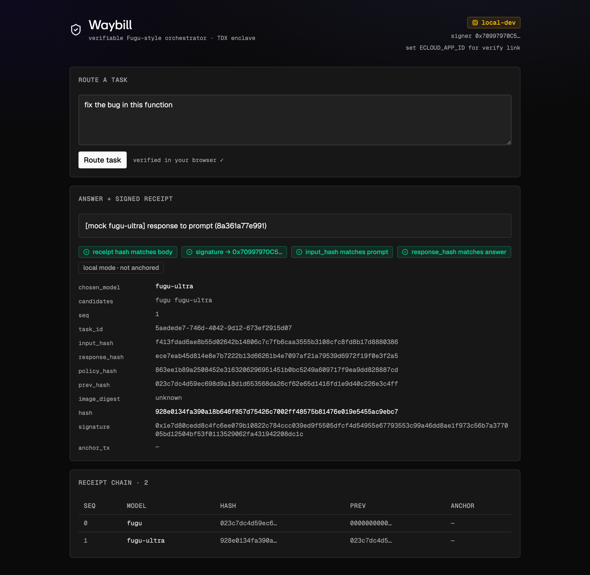

<div align="center">

# 🧾 Waybill

**A verifiable Fugu-style orchestrator.**

Routing logic runs inside an **Intel TDX enclave** on [EigenCompute](https://www.eigencloud.xyz/) and signs a receipt for every decision —
`{ task → model chosen → response hash }` — hash-chained and anchored on-chain.
Anyone can verify *which* model the orchestrator picked, that the router wasn't tampered with, and that the log wasn't reordered. **Trusting neither you nor your cloud.**

[Trust model](#what-a-receipt-proves--does-not-prove) · [Quickstart](#quickstart-local) · [API](#http-api) · [Verify](#verify-trusting-no-one) · [Deploy](#deploy-to-eigencompute-tdx--sepolia)



</div>

---

> [!IMPORTANT]
> Waybill verifies the **orchestration**, not the **inference**. The models run *outside* the
> enclave (Sakana Fugu). Call it a *"verifiable Fugu-style orchestrator"*, never *"verifiable Fugu"*.
> Read the [trust model](#what-a-receipt-proves--does-not-prove) before you tweet.

## What is this?

An LLM router is a trust black box: it claims it sent your hard task to the strong model and your
cheap task to the cheap one — but you can't check, and neither can your auditor. Waybill makes the
routing decision **verifiable**. Every `/route` call produces a signed, hash-chained receipt that a
third party can check end-to-end with no access to the server and no trust in the operator.

The router itself runs inside a TDX enclave whose image digest is recorded on-chain, and signs with a
key that is *sealed to that enclave* — so a valid signature provably came from the exact, unmodified
router image, running in a genuine TEE.

## Flow

```
                ┌──────────────── Intel TDX enclave (EigenCompute) ─────────────────┐
  task  ───────▶│  hash input → run policy → call Fugu model → hash response         │
                │  → build receipt → sign (enclave-sealed key) → anchor on Sepolia   │
                └───────────────────────────────────────────────────────────────────┘
                                              │
                                              ▼
                          answer  +  signed receipt  +  verify link
```

A **receipt** is canonical JSON like:

```jsonc
{
  "task_id": "…",
  "input_hash":    "sha256(prompt)",
  "candidates":    ["fugu", "fugu-ultra"],   // models the policy could pick
  "chosen_model":  "fugu-ultra",             // the one it did pick
  "policy_hash":   "sha256(policy source)",  // pins the exact routing logic
  "response_hash": "sha256(answer)",
  "image_digest":  "the on-chain enclave image",
  "prev_hash":     "links to the previous receipt",
  "seq":           7,
  "hash":          "sha256(everything above)",
  "signature":     "enclave key over `hash`",
  "signer":        "0x… enclave address",
  "anchor_tx":     "0x… Sepolia tx, or null"
}
```

## What a receipt proves / does NOT prove

**Proves**
- the routing decision was made by the exact image whose digest is recorded on-chain, in a genuine TDX enclave;
- for each task — the candidate models, the chosen model, the policy hash, and the response hash;
- the log is complete and correctly ordered (hash-chain + on-chain anchor).

**Does NOT prove**
- that the answer is *correct*;
- that the provider actually served the model it claimed — inference is outside the enclave, so the
  receipt is only honest that *"the router asked for model X and got a response hashing to H"*;
- anything about the prompt or response beyond their hashes.

## Quickstart (local)

```bash
npm install
npm run build:web   # builds the TS + Tailwind UI into public/  (needs eigen-design, see UI note)
export WAYBILL_SIGNER_KEY=$(npm run -s verify keygen | head -1 | cut -d= -f2)
npm start           # http://localhost:8080
```

Open **http://localhost:8080** — the UI routes a task, shows the signed receipt, and **re-verifies it
in your browser** (recomputes the hash with SubtleCrypto, recovers the signer with ethers). The green
badges are real checks, not decoration.

Or by hand:

```bash
curl -sX POST localhost:8080/route -H 'content-type: application/json' \
  -d '{"prompt":"fix the bug in this function"}'
```

Runs **offline by default**: deterministic mock Fugu responses, no anchoring. For real routing set
either `SAKANA_API_KEY` ([console.sakana.ai](https://console.sakana.ai)) or `OPENROUTER_API_KEY`
([openrouter.ai/sakana/fugu-ultra](https://openrouter.ai/sakana/fugu-ultra)) in a local `.env`, and
`WAYBILL_RPC_URL` (Sepolia) to anchor every receipt.

> **Backend only?** `npm install && npm start` is enough for the API + verifier CLI. The UI build
> step is the only part that needs the design system below.

## HTTP API

| Method & path | Body | Returns |
|---|---|---|
| `POST /route` | `{ "prompt": "…" }` | `{ answer, receipt }` — routes, signs, anchors |
| `GET /chain` | — | `{ signer, receipts }` — the hash-chained log for this run |
| `GET /verify` | — | `{ signer, policy_hash, anchoring, attestation }` — TEE attestation snapshot |
| `GET /healthz` | — | liveness + signer + image digest + receipt count |

`GET /verify` reports `attestation.source: "tee"` with the sha256 of the EigenCompute-injected KMS
signing key (and a `verify_url` to the dashboard) when running in an enclave, or `"local-dev"` locally.

## Verify (trusting no one)

The UI verifies automatically. The same checks are available as a CLI — point it at a saved receipt:

```bash
# save a receipt
curl -sX POST localhost:8080/route -H 'content-type: application/json' \
  -d '{"prompt":"fix the bug"}' | npx tsx -e \
  'process.stdin.once("data",d=>require("fs").writeFileSync("r.json",JSON.stringify(JSON.parse(d).receipt)))'

# verify it — recomputes the hash, recovers the signer, checks your prompt/answer
# (the `--` separates npm's args from the script's flags)
npm run verify -- receipt r.json --prompt "fix the bug" --answer "<the answer>"

# verify a whole chain (links + monotonic seq)
npm run verify -- chain chain.json
```

What it checks (offline unless `WAYBILL_RPC_URL` is set for the anchor step):

1. the receipt hash recomputes from the body;
2. the signature recovers to the receipt's signer address;
3. *(chain)* `prev_hash` links and `seq` is monotonic from 0;
4. *(`--prompt`/`--answer`)* `input_hash` / `response_hash` match what you actually got;
5. *(RPC set)* `anchor_tx` is mined, sent from the signer, and its calldata equals the receipt hash.

The enclave/image step (TD Quote + on-chain image digest) is the EigenCompute verify dashboard:
`https://verify-sepolia.eigencloud.xyz/app/<APP_ID>`.

## Routing policy

Plain data — an ordered list of `(predicate, model)` rules; first match wins. The catch-all is the
default. `POLICY_HASH` is the sha256 of [`src/policy.ts`](src/policy.ts), so each receipt pins exactly
which routing logic ran. Two real [Sakana Fugu](https://sakana.ai/fugu/) tiers:

| If the prompt… | → model |
|---|---|
| looks like code (`bug`, `function`, `sql`, `refactor`, …) | `fugu-ultra` |
| is long (> 2000 chars) | `fugu-ultra` |
| otherwise | `fugu` |

Bring your own policy by editing `RULES` + `route()`; swap in a classifier if keyword matching falls short.

## Deploy to EigenCompute (TDX, Sepolia)

```bash
docker build --platform linux/amd64 \
  --build-arg GIT_SHA=$(git rev-parse --short HEAD) \
  --build-arg BUILD_TIME=$(date -u +%FT%TZ) \
  -t <registry/waybill:tag> . && docker push <registry/waybill:tag>

ecloud compute app env set \
  WAYBILL_SIGNER_KEY=0x... WAYBILL_RPC_URL=https://sepolia... \
  SAKANA_API_KEY=... IMAGE_DIGEST=<digest> ECLOUD_APP_ID=<app-id>

rm -f Dockerfile && touch .env
echo n | ecloud compute app deploy --name waybill --image-ref <registry/waybill:tag> \
  --skip-profile --env-file .env --instance-type g1-standard-4t \
  --log-visibility public --resource-usage-monitoring enable --verbose
```

`WAYBILL_SIGNER_KEY` is a **sealed secret** — decryptable only inside the attested TEE, so a valid
signature traces to a key that exists only in the genuine enclave running the on-chain-recorded image.
Verify the enclave + image digest at `https://verify-sepolia.eigencloud.xyz/app/<APP_ID>`.

## Config

| env | meaning | unset → |
|-----|---------|---------|
| `WAYBILL_SIGNER_KEY` | enclave-bound signing key | **required** |
| `WAYBILL_RPC_URL` | Sepolia RPC; anchors every receipt | local mode (no anchor) |
| `IMAGE_DIGEST` | on-chain image digest | `"unknown"` |
| `ECLOUD_APP_ID` | EigenCompute app id; builds the `/verify` link | `"local"` |
| `SAKANA_API_KEY` | native Sakana Fugu key (fugu + fugu-ultra) | mock mode |
| `OPENROUTER_API_KEY` | OpenRouter key; serves `sakana/fugu-ultra` | mock mode |
| `FUGU_API_URL` | base URL override | inferred from the key |
| `FUGU_MODEL_MAP` | JSON map: router id → provider model id | provider default |

Set `SAKANA_API_KEY` **or** `OPENROUTER_API_KEY` for real routing (mock if neither). A local
`.env` is loaded automatically; on EigenCompute these are sealed secrets.

## Layout

```
src/policy.ts          declarative routing rules; POLICY_HASH pins the logic
src/adapters.ts        Sakana Fugu adapter (OpenAI-compatible; deterministic mock fallback)
src/receipt.ts         canonical hashing + chaining + signing
src/signer.ts          enclave-bound key (ethers, EIP-191 over the receipt hash bytes)
src/anchor.ts          on-chain anchor (Sepolia self-tx + calldata)
src/attestation.ts     TEE attestation snapshot (KMS pem hash + app id)
src/app.ts             Express: /route /chain /verify /healthz + serves the UI
src/verify.ts          public verifier CLI
web/                   Vite + React 19 + TS + Tailwind v4 UI → builds to public/
test/waybill.test.ts   runnable self-check (node:test): hashing, chaining, sign/recover, tamper, routing
```

Stack: **TypeScript** end to end — Node + Express + [ethers v6](https://docs.ethers.org/v6/) backend,
Vite + React 19 + Tailwind v4 frontend. No build step for the server (run via `tsx`).

```bash
npm test          # 5 self-checks, no framework
```

## UI & the design system

The frontend uses [`@layr-labs/eigen-design`](https://github.com/Layr-Labs) — EigenLayer's React +
Tailwind v4 component library, published **privately** to GitHub Packages. It is **not** included in
this repo. To build the UI, make it resolvable in one of two ways:

```bash
# Option A — install from GitHub Packages (needs a PAT with read:packages, authorized for Layr-Labs)
echo "@layr-labs:registry=https://npm.pkg.github.com" >> web/.npmrc
echo "//npm.pkg.github.com/:_authToken=\${GITHUB_TOKEN}" >> web/.npmrc
# then in web/package.json set:  "@layr-labs/eigen-design": "^0.1.0"

# Option B — vendor a built copy to web/vendor/eigen-design  (kept as `file:./vendor/eigen-design`)
```

Without it, the **API, verifier CLI, and self-checks still work** — only `npm run build:web` needs it.

## Honest scope (v1)

CPU-only TDX (no in-enclave GPU inference). Developer-is-trusted on mainnet alpha. Anchors every
receipt as a self-tx on Sepolia — switch to per-run roots via a contract if cost matters. The signer
is a sealed-secret key, not yet a true enclave-*derived* wallet (upgrade path noted in `src/signer.ts`).
Roadmap: pin provider response metadata, optional provider-signed responses, and chaining an attested
inference provider so the model becomes verifiable too.

## License

MIT
